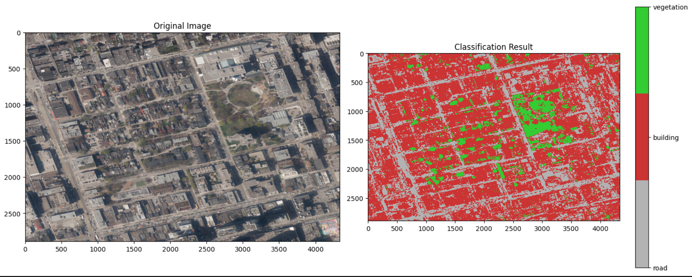
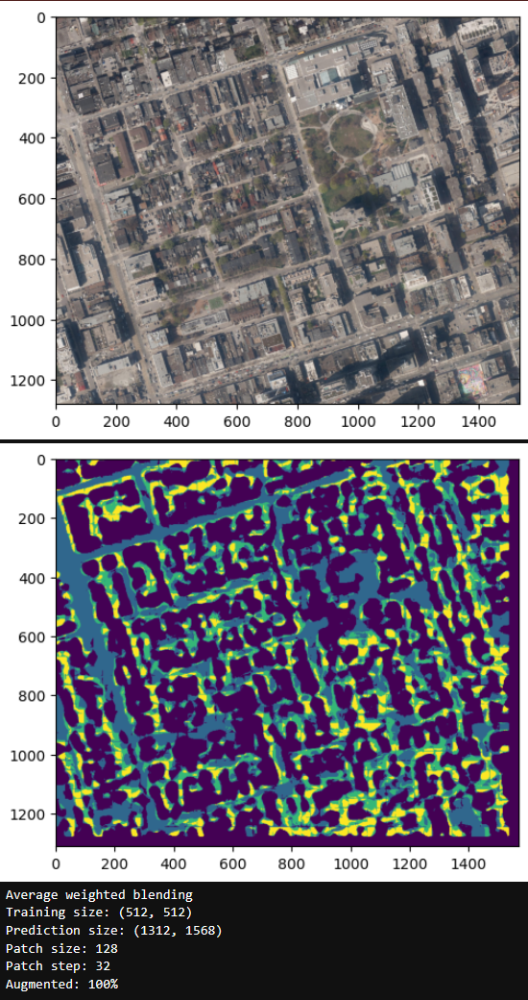

# Land Use Land Cover Machine Learning Classification
The objective of this project is to create an accurate vector map of Toronto using machine learning classification of aerial imagery. 

## 1) Simple Random Forest Classifier
**Model:** Random Forest
**Accuracy:** 0.44

To establish a simple baseline and get a quick warm up on handling image and geospatial data, the first classifier was kept to small scale. It is only a simple random forest classifier and included only 5 blocks squared of downtown Toronto and restricted to only 3 classes (road, building, vegetation).

To improve the accuracy, the distribution of training classes was balanced out, and the hyperparameters were tuned although this showed almost no improvement in validation accuracy or final image prediction. 

The Random Forest approach was helpful as a simple baseline, but it lacks spatial context and does not apply to the problem well. It also is unlikely to scale well.

## 2) Convolutional Neural Network Classifier
**Model:** Convolutional Neural Network (CNN)
**Accuracy:** 0.70

CNNs are much more applicable to the problem and used more commonly in image classification tasks since they are able to pick up on spatial relationships, and scale much more efficiently.

**Training Data Improved**
In the previous model, training samples were pure (the entire image was vegetation, for example). This approach was flawed, so for this model a section of Toronto was digitized and turned into a labelled raster.

The raster was split into smaller "patches" and the CNN was trained on these. To help enforce spatial relationships, the patches contained some overlap with each other. 

**Data Leakage**
The first implementation of this approach caused a severe data leakage (spotted because of unusually high training accuracy). Because there was overlap between the patches, and the test set was a random sample of the patches, some of the data in the test set overlapped with data in the training set - a terrible example of data leakage. 

This was resolved by splitting the image into training and test areas first, then splitting those into patches with overlap to avoid any leakage. 

**Data Augmentation**
To make the most of the digitized data, the training patches were randomly augmented. Augmentation included horizontal flipping, rotation (90, 180, 270), brightness adjustment, contrast adjustment, random zoom with rescaling, and some random gaussian noise. The model improved significantly with these augmentations, especially when predicting areas in shadow.

**Performance**
Train/test raster: 512x512 pixels split into 234 128x128px augmented patches with 32px overlap. Trained on a U-net CNN model with early stopping, stopped after 39 epochs with validation accuracy of 0.7

